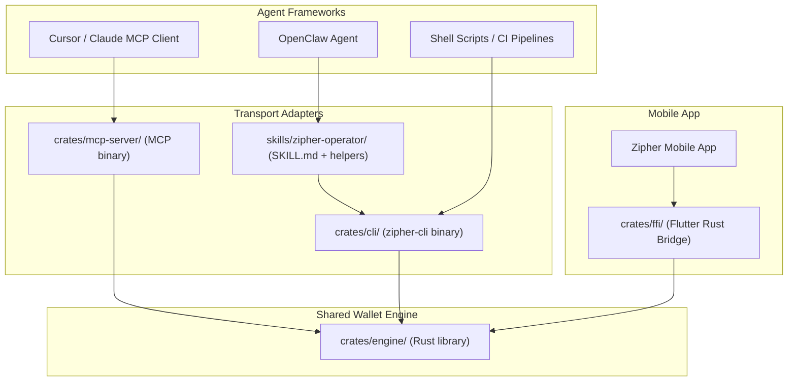
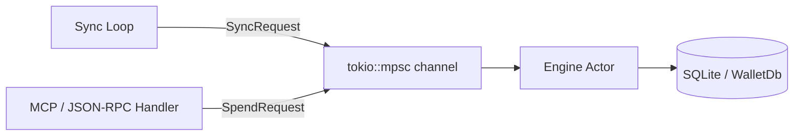
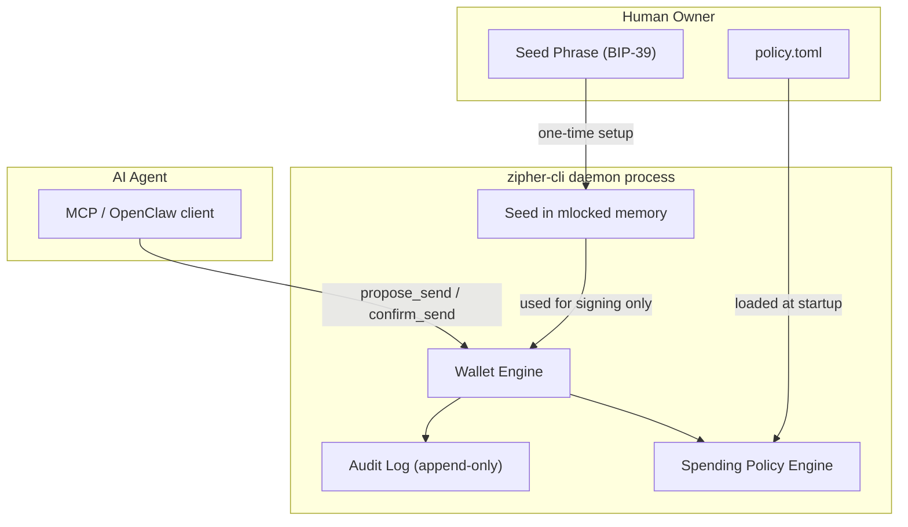
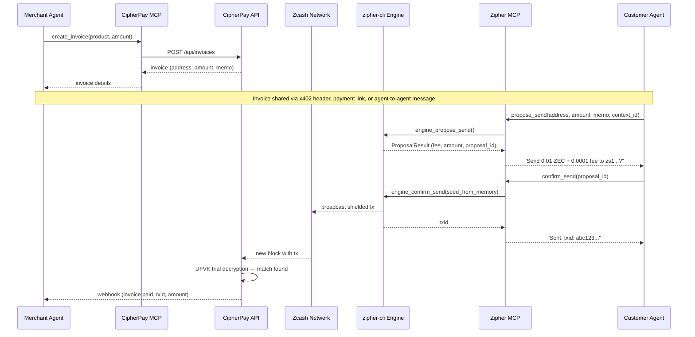

# Zipher Agent Wallet — Product Requirements Document

> **Status:** Draft v1.0
> **Author:** Atmosphere Labs
> **Date:** March 2026
> **Repo:** `zipher-app` (main branch)

---

## 1. Executive Summary

**zipher-cli** is a headless, local-first Zcash light wallet for AI agents. It lets any autonomous agent — running on any machine the operator controls — hold ZEC, construct shielded transactions, and pay for resources without human intervention. No full node. No cloud custody. Keys never leave the hardware.

zipher-cli wraps the same Rust wallet engine that powers the Zipher mobile app, repackaged as a standalone binary with CLI subcommands, a daemon mode for background sync, and transport adapters for both MCP (Model Context Protocol) and OpenClaw agent frameworks.

**Where it fits in the Atmosphere Labs stack:**

| Product | Role | Status |
|---------|------|--------|
| **Zipher** (mobile) | Consumer wallet — financial privacy, finally user-friendly | Beta |
| **zipher-cli** | Agent/developer wallet — headless, daemon, MCP + OpenClaw | This PRD |
| **CipherPay** | Merchant payment processor — invoices, x402 verification, webhooks | Live |
| **CipherScan** | Block explorer — mainnet and testnet | Live |

The blockchain is the integration layer. Zipher sends ZEC. CipherPay detects it. No direct communication between the two systems is required.

---

## 2. Problem Statement

The agentic payments stack has arrived. x402, MPP, and A2A let AI agents pay for APIs, compute, and data without a human in the loop.

But every one of these protocols assumes the agent already has a wallet.

- **x402** needs a signed payment authorization. Something has to produce that signature.
- **MPP** needs a funded account. Something has to hold the keys.
- **A2A** defines agent-to-agent communication. Neither agent comes with a wallet built in.

The **Open Wallet Standard (OWS)** — backed by PayPal, Circle, Solana Foundation, and 18 others — addresses multi-chain key storage and commodity signing (ECDSA, Ed25519). But OWS cannot produce Zcash shielded transactions. Shielded sends require zero-knowledge proof generation using Sapling/Orchard circuits — fundamentally different from "hash and sign." OWS's signing interface doesn't cover this.

**The gap:** there is no agent-ready wallet for private payments. Every existing Zcash wallet (Zashi, Zingo, Zallet) is designed for human consumers with a GUI. None expose a programmatic interface for autonomous agents.

zipher-cli fills this gap. It gives agents a way to hold ZEC, construct shielded transactions, and broadcast them — all from a headless binary that runs wherever the operator deploys it: a $5 VPS, a Mac Mini, a Raspberry Pi, a Docker container, a Kubernetes pod.

---

## 3. Landscape & Positioning

| | zipher-cli | Zallet (ZalletClaw) | OWS | Zashi | Zingo |
|---|---|---|---|---|---|
| **Architecture** | Light client (lightwalletd) | Full node (zcashd) | Key vault only | Light client | Light client |
| **Deploy footprint** | ~50MB params + binary | ~100GB full chain | ~10MB | Mobile app | Mobile/desktop app |
| **Shielded sends** | Yes (Sapling + Orchard) | Yes | No (ECDSA/Ed25519 only) | Yes | Yes |
| **Agent-ready** | MCP + OpenClaw + CLI | OpenClaw skill only | Multi-chain signing | No programmatic API | No programmatic API |
| **Privacy** | Shielded by default | Shielded | Transparent chains | Shielded | Shielded |
| **Daemon mode** | Yes (background sync + RPC) | Yes (zcashd is always-on) | N/A | No | No |
| **Full node required** | No | Yes | No | No | No |

### Key positioning

**OWS is complementary, not competitive.** OWS defines a local-first encrypted vault with a standard storage format (AES-256-GCM, scrypt KDF) and a uniform signing interface across EVM, Solana, Bitcoin, Tron, and more. Its design principles — local-first, key isolation, keys never leave the machine — align exactly with zipher-cli's architecture. But OWS handles commodity elliptic curve signing. Zcash shielded transactions require zero-knowledge proof generation that OWS's interface cannot express. A future integration could use OWS's vault format for key storage while zipher-cli handles ZK proof generation on top.

**ZalletClaw validates the UX pattern.** Paul Brigner's OpenClaw skill for Zallet demonstrates the correct agent spending flow: preflight summary, explicit confirmation, execution, status polling, balance verification. zipher-cli adopts this exact pattern (`propose_send` / `confirm_send`). The difference: ZalletClaw requires a running Zallet full node (~100GB chain, hours of initial sync, significant hardware). zipher-cli achieves the same functionality with a light client that syncs in minutes and runs on minimal hardware.

**Same privacy. 1/1000th the infrastructure.**

---

## 4. Product Architecture

### Layered stack



The engine crate is the single source of truth for wallet logic. Every consumer — mobile app, CLI, MCP server, OpenClaw skill — uses the same Rust code for key derivation, proof generation, transaction construction, and blockchain interaction.

### Cargo workspace structure

The current `rust/` directory is a single crate that bundles the engine, FFI bridge, and Flutter codegen together. This must be split into a Cargo workspace so the CLI and MCP server can depend on the engine without pulling in `flutter_rust_bridge`.

```
rust/
├── Cargo.toml                    # workspace root
└── crates/
    ├── engine/                   # shared wallet engine
    │   ├── Cargo.toml            # zcash_client_*, tokio, rusqlite, zeroize
    │   └── src/
    │       ├── lib.rs
    │       ├── wallet.rs         # create, restore, open, close, delete
    │       ├── query.rs          # addresses, balances, transactions
    │       ├── sync.rs           # background sync loop, progress
    │       ├── send.rs           # propose, confirm, shield, proof generation
    │       └── policy.rs         # NEW: spending limits, allowlist, audit log
    │
    ├── ffi/                      # Flutter Rust Bridge (mobile app)
    │   ├── Cargo.toml            # depends on engine + flutter_rust_bridge
    │   └── src/
    │       ├── lib.rs
    │       ├── api/
    │       │   ├── wallet.rs     # FFI types (ChainType, WalletBalance, etc.)
    │       │   └── engine_api.rs # thin facade mapping Dart types to engine calls
    │       └── frb_generated.rs
    │
    ├── cli/                      # NEW: zipher-cli binary
    │   ├── Cargo.toml            # depends on engine + clap + tokio
    │   └── src/
    │       └── main.rs
    │
    └── mcp-server/               # NEW: MCP server binary
        ├── Cargo.toml            # depends on engine + MCP SDK
        └── src/
            └── main.rs
```

The engine crate has **zero** Flutter/mobile dependencies. The FFI crate owns `flutter_rust_bridge`. The CLI adds `clap` for argument parsing. The MCP server adds the MCP protocol handler. Clean separation.

### Concurrency model

The engine currently uses `Mutex<Option<ZipherEngine>>` with short-lived SQLite connections, WAL journal mode, and 10-second busy timeouts. This works for the mobile app (single-threaded UI calls).

For daemon mode — where a background sync loop and RPC handlers run concurrently — the engine adopts an **actor-channel pattern**:



A single engine actor task owns the `WalletDb` connection. Sync and RPC handlers send requests through a `tokio::mpsc` channel. The actor processes them sequentially. This eliminates database lock contention entirely — no concurrent SQLite access, no `DatabaseBusy` errors, no need for complex locking strategies.

---

## 5. Core Engine

### What already exists

The Rust wallet engine (`rust/src/engine/`) exposes 28 functions through `rust/src/api/engine_api.rs`, covering the full wallet lifecycle:

**Wallet lifecycle:**
- `engine_create_wallet` — generate seed, initialize database, return seed phrase
- `engine_restore_from_seed` — restore wallet from BIP-39 mnemonic + birthday height
- `engine_restore_from_ufvk` — restore view-only wallet from Unified Full Viewing Key
- `engine_open_wallet` / `engine_close_wallet` — open/close wallet database
- `engine_delete_wallet_data` — remove wallet files from disk

**Sync:**
- `engine_start_sync` / `engine_stop_sync` — start/stop compact block scanning
- `engine_get_sync_progress` — synced height, latest height, scanning status
- `engine_register_inactive_wallet` / `engine_unregister_inactive_wallet` — background sync for multiple wallets

**Spend:**
- `engine_propose_send` — create a send proposal (amount, fee) without signing
- `engine_confirm_send` — sign and broadcast a pending proposal (requires seed)
- `engine_send_payment` — legacy one-step send (propose + sign + broadcast)
- `engine_shield_funds` — shield transparent balance to the shielded pool
- `engine_get_max_sendable` — maximum amount sendable to a given address

**Query:**
- `engine_get_wallet_balance` — shielded, transparent, and total balances
- `engine_get_addresses` — unified and transparent addresses
- `engine_get_transactions` — transaction history with memos
- `engine_export_ufvk` — export Unified Full Viewing Key
- `engine_get_birthday` / `engine_get_wallet_synced_height`
- `engine_has_spending_key` — check if wallet can spend (vs view-only)

**Validation:**
- `engine_validate_address` — check address validity and pool type
- `engine_validate_seed` — check BIP-39 mnemonic validity

### What's needed for agent use

**Spending policy engine** (`policy.rs`):
Client-side enforcement of transaction limits, implemented in the Rust engine. Zcash has no smart contract account abstraction — all policy enforcement is local.

- `max_per_tx` — maximum ZEC per single transaction (reject proposals exceeding this)
- `daily_limit` — rolling 24-hour spending cap
- `allowlist` — optional set of approved destination addresses (reject sends to unlisted addresses)
- `require_context_id` — every `propose_send` must include a `context_id` string explaining why the agent is spending
- `approval_threshold` — amount above which the engine pauses for human approval

Policy is stored in a local config file (`~/.zipher/policy.toml`) and loaded at daemon startup. Only the Owner Key holder can modify it.

**Daemon sync mode:**
The current `engine_start_sync` runs a single scan pass. For agent use, the daemon maintains a persistent sync loop — polling for new blocks, scanning, and keeping the wallet up to date continuously. `get_balance` is always near-instant because the wallet is always synced.

**Note consolidation:**
AI agents receiving many small payments (micropayments for API calls, tips, etc.) accumulate many small shielded notes. Each note adds to transaction weight and fees. The engine automatically consolidates notes when the count exceeds a configurable threshold — merging N small notes into fewer larger ones in a background shielded-to-self transaction.

**Sapling params manager:**
Shielded transaction proofs require two parameter files (~50MB total): `sapling-spend.params` and `sapling-output.params`. The engine checks for these at startup, downloads them from a trusted source if missing, verifies SHA-256 checksums, and caches them in `~/.zipher/params/` (or a configurable path via `ZIPHER_PARAMS_DIR`). For Docker deployments, params are baked into the image.

**Audit log:**
Append-only log of every `propose_send` and `confirm_send`, recording: timestamp, context_id, destination address, amount, fee, txid (on success), error (on failure). Stored in a separate SQLite table within the wallet database. The Owner can review this log to verify agent behavior.

**Spend rate limiting / note locking:**
Agents operate fast. If three `confirm_send` calls arrive in 10 seconds, the engine must handle the fact that notes spent in the first transaction are unavailable until confirmed. The engine enforces a **sequential send queue**: spend requests are processed one at a time through the actor channel. If a note is locked in an unconfirmed transaction, subsequent proposals return a `NOTE_LOCKED` error with the pending txid. Chaining unconfirmed shielded change is impractical — the policy enforces sequential sends.

---

## 6. CLI Design

### Subcommands

Inspired by ZalletClaw's preflight/confirm/execute pattern:

```
WALLET LIFECYCLE
  zipher-cli wallet create [--name NAME] [--data-dir PATH]
  zipher-cli wallet restore --seed-stdin --birthday HEIGHT [--data-dir PATH]
  zipher-cli wallet open [--data-dir PATH]
  zipher-cli wallet close
  zipher-cli wallet backup
  zipher-cli wallet delete --confirm

SYNC
  zipher-cli sync start [--background]
  zipher-cli sync status
  zipher-cli sync stop

QUERY
  zipher-cli balance [--pool shielded|transparent|all]
  zipher-cli address [--type unified|transparent]
  zipher-cli transactions [--limit N] [--since HEIGHT]

SEND (two-step: propose then confirm)
  zipher-cli send propose --to ADDRESS --amount AMOUNT [--memo TEXT] [--context-id ID]
  zipher-cli send confirm --proposal-id ID
  zipher-cli send max --to ADDRESS

SHIELD
  zipher-cli shield

POLICY
  zipher-cli policy show
  zipher-cli policy set --daily-limit AMOUNT --per-tx-cap AMOUNT
  zipher-cli policy add-allowlist ADDRESS
  zipher-cli policy remove-allowlist ADDRESS

DAEMON
  zipher-cli daemon start [--port 9067] [--mcp] [--json-rpc]
  zipher-cli daemon stop
  zipher-cli daemon lock
  zipher-cli daemon status

AUDIT
  zipher-cli audit [--limit N] [--since TIMESTAMP]
```

### Key UX rules

**`propose` never requires the seed.** It returns a summary — amount, fee, destination, proposal ID — for review. This is the "preflight" step. No key material is touched.

**`confirm` requires the seed.** The seed is read from:
1. Environment variable `ZIPHER_SEED` (preferred for daemon mode)
2. Standard input pipe (for interactive or scripted use)
3. Never from CLI arguments (would leak into shell history, `/proc`, `ps` output)

**JSON output by default.** All commands emit structured JSON for machine consumption. Add `--human` for readable format. This ensures agents, scripts, and MCP wrappers can parse output deterministically.

**`daemon lock`** immediately zeroizes the seed in RAM without killing the sync process. All spend commands return `WALLET_LOCKED` until the operator re-authenticates by providing the seed again. Useful for emergency response — stop all spending without losing sync progress.

**`--testnet` flag** switches the engine to Zcash testnet (`ChainType::Testnet`). Testnet wallets use independent seeds and separate data directories, matching the mobile app's testnet isolation behavior.

---

## 7. Transport Adapters

### MCP Server (`crates/mcp-server/`)

The MCP server exposes the engine as tool calls for MCP-compatible agent frameworks (Cursor, Claude Desktop, custom agents). It runs as part of the daemon process or as a standalone binary.

**Tool surface:**

| Tool | Description | Requires seed |
|------|-------------|---------------|
| `wallet_status` | Sync height, balance, address, policy summary | No |
| `get_balance` | Pool-specific balance (shielded, transparent, total) | No |
| `propose_send` | Create send proposal (returns amount, fee, proposal_id) | No |
| `confirm_send` | Sign and broadcast a pending proposal | Yes (from daemon memory) |
| `shield_funds` | Shield transparent balance to shielded pool | Yes (from daemon memory) |
| `get_transactions` | Recent transaction history with memos | No |
| `sync_status` | Current sync state (height, progress, errors) | No |
| `validate_address` | Check if an address is valid and its pool type | No |

**The MCP server never accepts seed phrases as tool arguments.** The seed is configured once at daemon startup (from `ZIPHER_SEED` env var) and held in mlocked, zeroized memory. The agent/LLM never sees the key material. `confirm_send` uses the seed from daemon memory — the MCP caller only provides the `proposal_id`.

**Error handling:** Every MCP response includes a deterministic `error_code` and a human-readable `message`. LLMs hallucinate success when tools fail silently or return opaque errors. Explicit codes let the agent retry, wait, or escalate to the human operator.

| Error Code | Meaning | Agent action |
|------------|---------|-------------|
| `SUCCESS` | Operation completed | Proceed |
| `INSUFFICIENT_FUNDS` | Balance too low for proposed send | Alert operator or wait for funding |
| `NOTE_LOCKED` | Notes locked in pending transaction | Wait and retry |
| `SYNC_REQUIRED` | Wallet not synced to chain tip | Wait for sync or call `sync_status` |
| `POLICY_EXCEEDED` | Send exceeds daily limit or per-tx cap | Reduce amount or request policy change |
| `ADDRESS_NOT_ALLOWED` | Destination not in allowlist | Request allowlist update |
| `WALLET_LOCKED` | Daemon in locked state (seed zeroized) | Alert operator to unlock |
| `NETWORK_TIMEOUT` | Cannot reach lightwalletd server | Retry with backoff |
| `INVALID_PROPOSAL` | Proposal ID not found or expired | Create new proposal |
| `CONTEXT_REQUIRED` | `context_id` missing (policy requires it) | Retry with context_id |

### OpenClaw Skill (`skills/zipher-operator/`)

The OpenClaw skill wraps `zipher-cli` for OpenClaw-compatible agents. It follows the same pattern as Paul Brigner's ZalletClaw skill:

**Structure:**
```
skills/zipher-operator/
├── SKILL.md                 # agent instructions
├── references/
│   └── cli-commands.md      # subcommand reference
└── scripts/
    ├── check_status.sh      # balance + sync check
    ├── send_preflight.sh    # propose and format summary
    └── confirm_send.sh      # confirm with seed from env
```

**Three operating modes:**

1. **Direct execution** — the agent runs non-secret commands directly: balance, transactions, sync status, address lookup.
2. **Guidance mode** — for secret-sensitive tasks (seed import, wallet creation), the skill gives exact instructions and waits for the human to complete the step locally.
3. **Guarded send mode** — the agent builds a preflight summary, restates the exact send, and requires explicit confirmation before submitting.

**Safety boundaries (inherited from ZalletClaw):**
- Never ask the user to paste mnemonics, passphrases, or private keys into chat
- Never execute secret-handling steps on the user's behalf
- Never send funds without an explicit confirmation step first
- Never auto-approve sends above the policy threshold

Both MCP and OpenClaw adapters ship in the same phase. Equal priority.

---

## 8. Security Model

### Key architecture



**Owner Key** (seed phrase) — held by the human operator. Required for:
- Initial wallet creation and setup
- Daemon startup (seed provided via env var, loaded into mlocked memory)
- Policy changes (editing `policy.toml`)
- Emergency sweep (moving all funds to a new wallet)
- Key rotation

**Agent Credential** — the daemon process, once started with the seed, holds it in memory protected by `mlock` (pinned, never swapped to disk) and `zeroize` on drop (actively scrubbed, not garbage collected). The `zeroize` crate is already a dependency. The MCP and JSON-RPC interfaces expose only `propose_send` and `confirm_send` — the seed is never serialized, never returned, never passed through the protocol boundary.

This is **client-side enforcement**, not smart contract-based. Zcash does not support account abstraction. The Rust engine is the trust boundary. If an attacker gains code execution on the daemon process, they have the seed. The security model assumes the operator controls the machine.

### Spending policy

Enforced in the Rust engine before any transaction is constructed:

| Policy field | Type | Description |
|-------------|------|-------------|
| `max_per_tx` | ZEC amount | Maximum per single transaction. Proposals exceeding this are rejected. |
| `daily_limit` | ZEC amount | Rolling 24-hour spending cap. Tracked via audit log timestamps. |
| `allowlist` | Address list | If non-empty, only these destinations are permitted. All others rejected. |
| `require_context_id` | bool | If true, every `propose_send` must include a `context_id` string. |
| `approval_threshold` | ZEC amount | Above this amount, the engine returns `APPROVAL_REQUIRED` and waits for human confirmation via a separate authenticated channel. |
| `min_spend_interval_ms` | u64 | Minimum milliseconds between consecutive `confirm_send` calls. Prevents rapid-fire spending. |

Policy is stored in `~/.zipher/policy.toml` and loaded at daemon startup. Only the operator can modify it (file permissions). The engine re-reads policy on SIGHUP.

### Kill switch

`zipher-cli daemon lock` immediately:
1. Zeroizes the seed in RAM
2. Leaves the sync loop running (wallet stays up to date)
3. All spend commands (`confirm_send`, `shield_funds`) return `WALLET_LOCKED`
4. Operator re-authenticates by calling `zipher-cli daemon unlock` (provides seed again)

This is useful for emergency response — if the operator suspects compromise, they can kill all spending instantly without losing sync progress. Re-authentication restores full functionality.

### Threat model

| Threat | Vector | Mitigation |
|--------|--------|------------|
| Seed in LLM context window | Agent framework passes tool results to LLM | Seed never appears in MCP/RPC responses. Only proposal summaries, balances, and txids are returned. |
| Seed in shell history | `zipher-cli send confirm --seed "..."` | Seed read from env var or stdin pipe, never from CLI arguments. |
| Seed on disk (swap/crash dump) | OS swaps daemon memory to disk | `mlock` prevents page swapping. `zeroize` scrubs on process exit or `daemon lock`. |
| Agent drains wallet | Compromised or confused agent calls `confirm_send` repeatedly | Spending policy: `max_per_tx`, `daily_limit`, `min_spend_interval_ms`. |
| Confused deputy attack | Agent spends for wrong reason, owner can't tell why | Mandatory `context_id` on every spend, recorded in audit log. Owner reviews `zipher-cli audit`. |
| Compromised lightwalletd | Malicious server serves wrong blocks | Can withhold blocks (DoS) but cannot forge transactions (hash chain verification). Cannot learn wallet contents (compact blocks scanned locally). Cannot steal funds (no access to keys). |
| Note exhaustion | Many small notes make spends expensive or fail | Auto-consolidation when note count exceeds configurable threshold. |
| Denial of service (sync) | Lightwalletd goes offline | Engine retries with exponential backoff. Multiple lightwalletd servers can be configured as fallbacks. |

---

## 9. CipherPay Integration — The Full Loop

Two independent agents, two independent MCP servers, connected through the Zcash blockchain.



**The x402 flow** follows the same pattern. When a customer agent encounters an HTTP 402 response from an x402-protected API:

1. The 402 response body contains a CipherPay payment request (address, amount, memo)
2. The agent calls `propose_send` via Zipher MCP
3. On confirmation, the shielded transaction is broadcast
4. CipherPay's x402 verification endpoint (`POST /api/x402/verify`) trial-decrypts the transaction with the merchant's UFVK
5. The API server receives a callback confirming payment and returns 200 with the requested data

No coordination between the two MCPs. The Zcash blockchain is the message bus.

---

## 10. Deployment

### Target environments

zipher-cli runs anywhere with outbound TCP access to a lightwalletd server:

| Environment | Example | Notes |
|-------------|---------|-------|
| VPS | Hetzner, DigitalOcean, OVH | $5/mo tier is sufficient |
| Home server | Mac Mini, Raspberry Pi, NUC | ARM and x86_64 supported |
| Docker | Any container runtime | Recommended for production |
| Kubernetes | Any cluster | StatefulSet with persistent volume for wallet data |
| CI/CD | GitHub Actions, GitLab CI | Ephemeral containers with pre-seeded wallet |

**Minimum requirements:**
- CPU: any (ARM64 or x86_64)
- RAM: ~100MB
- Disk: ~100MB (binary + Sapling params + wallet database)
- Network: outbound TCP to lightwalletd (port 9067 default)

### Sapling parameters strategy

Shielded proofs require `sapling-spend.params` (47MB) and `sapling-output.params` (3.5MB). These are constant — they never change.

**Docker (recommended):** Bake params into the image at build time. No first-run download. No network dependency at startup. The image is ~100MB total.

```dockerfile
FROM rust:1.82-slim AS builder
WORKDIR /build
COPY . .
RUN cargo build --release -p zipher-cli -p zipher-mcp-server

FROM debian:bookworm-slim
RUN apt-get update && apt-get install -y ca-certificates && rm -rf /var/lib/apt/lists/*
COPY --from=builder /build/target/release/zipher-cli /usr/local/bin/
COPY --from=builder /build/target/release/zipher-mcp-server /usr/local/bin/
COPY params/sapling-spend.params params/sapling-output.params /opt/zipher/params/
ENV ZIPHER_PARAMS_DIR=/opt/zipher/params
ENV ZIPHER_DATA_DIR=/data
VOLUME ["/data"]
EXPOSE 9067
ENTRYPOINT ["zipher-cli"]
CMD ["daemon", "start", "--mcp", "--port", "9067"]
```

**Non-Docker:** `zipher-cli wallet create` auto-downloads params on first use, verifies SHA-256 checksums, and caches them in `~/.zipher/params/`. Subsequent launches skip the download.

### Data persistence

Wallet data (SQLite databases, policy config, audit log) lives in `ZIPHER_DATA_DIR` (default `~/.zipher/`). For Docker, mount this as a persistent volume. For Kubernetes, use a PersistentVolumeClaim on the StatefulSet.

---

## 11. Phased Roadmap

| Phase | Name | Scope | Deliverable | Depends on |
|-------|------|-------|-------------|------------|
| **0** | Workspace | Cargo workspace restructure: extract engine crate, split FFI from engine | `crates/engine/` compiles independently. Flutter app still builds. No user-facing changes. | Nothing |
| **1** | CLI | `zipher-cli` binary: wallet lifecycle, sync, balance, address, transactions, two-step send | `zipher-cli wallet create && zipher-cli sync start && zipher-cli balance` works end-to-end from a terminal | Phase 0 |
| **2** | Security | Spending policy, audit log, daemon mode, kill switch, mlocked seed, note locking | `zipher-cli daemon start` runs background sync with policy enforcement. `zipher-cli audit` shows spend history. | Phase 1 |
| **3** | Transports | MCP server + OpenClaw skill (equal priority) | Agents call `propose_send` via MCP tool call or OpenClaw skill. Deterministic error codes. | Phase 2 |
| **4** | Integration | CipherPay end-to-end loop, x402 payment flow | Agent encounters x402 -> pays via Zipher MCP -> CipherPay confirms -> API returns data | Phase 3 + CipherPay x402 |
| **5** | Harden | Docker image, ARM cross-compilation, testnet CI, note consolidation, multi-server failover | Production-ready deployment artifacts. Automated integration tests on testnet. | Phase 4 |

### Phase 0 detail: workspace restructure

This is the critical enabling step. The current `rust/` crate mixes engine logic with Flutter codegen in a single compilation unit. Splitting into a workspace:

1. Create `rust/crates/engine/` — move `rust/src/engine/*.rs` here, add its own `Cargo.toml` with zcash_client_*, tokio, rusqlite, zeroize dependencies
2. Create `rust/crates/ffi/` — move `rust/src/api/` and `rust/src/frb_generated.rs` here, keep flutter_rust_bridge dependency
3. Update `rust/crates/ffi/Cargo.toml` to depend on `engine` via path
4. Verify Flutter app still builds (no logic changes, just crate boundaries)
5. Create `rust/crates/cli/` — empty binary crate depending on `engine` + `clap`
6. Create `rust/crates/mcp-server/` — empty binary crate depending on `engine`

No wallet logic changes. No user-facing changes. Just crate boundaries.

---

## Appendix A: References

| Resource | Relevance |
|----------|-----------|
| [Open Wallet Standard](https://openwallet.sh) | Multi-chain key vault standard. Complementary positioning — OWS handles commodity signing, Zipher handles ZK proofs. |
| [ZalletClaw](https://github.com/paulbrigner/zalletclaw) | OpenClaw skill for Zallet. UX reference for agent spending flow (preflight/confirm/execute). |
| [CipherPay](https://cipherpay.app) | Merchant payment processor. The receiving side of the agent payment loop. |
| [x402 Protocol](https://www.x402.org/) | HTTP 402 payment protocol for AI agents. CipherPay is the facilitator. |
| [Zcash librustzcash](https://github.com/zcash/librustzcash) | The Zcash Rust SDK that powers the engine. |
| [MCP Specification](https://modelcontextprotocol.io) | Model Context Protocol for agent tool calls. |

## Appendix B: Glossary

| Term | Definition |
|------|------------|
| **Compact blocks** | Stripped-down block summaries served by lightwalletd. ~1-2% the size of full blocks. Scanned locally for relevant transactions. |
| **lightwalletd** | Public infrastructure server that serves compact blocks to light clients. The engine connects to it for blockchain data. |
| **Sapling / Orchard** | Zcash shielded transaction protocols. Sapling (older, widely supported) and Orchard (newer, more efficient). Both require zero-knowledge proof generation. |
| **UFVK** | Unified Full Viewing Key. Allows viewing wallet balance and transactions but not spending. Used by CipherPay for payment detection. |
| **Note** | A shielded UTXO. Represents a discrete chunk of spendable shielded ZEC. |
| **Note consolidation** | Merging many small notes into fewer larger ones via a shielded-to-self transaction. Reduces future transaction costs. |
| **ZK proof** | Zero-knowledge proof. Cryptographic proof that a transaction is valid without revealing sender, receiver, or amount. |
| **MCP** | Model Context Protocol. Standard for AI agent tool calls (Cursor, Claude Desktop). |
| **OpenClaw** | Open-source AI agent platform. Uses "skills" (prompt files + scripts) to extend agent capabilities. |
| **OWS** | Open Wallet Standard. Multi-chain local-first key vault protocol. |
| **x402** | HTTP payment protocol. Server returns 402 with payment request, client pays, server verifies and returns data. |

---

*Atmosphere Labs — Making Zcash accessible. For everyone.*
